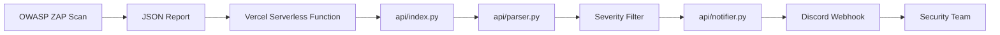

# 🚨 OWASP ZAP Alert Webhook

Pipeline serverless para receber relatórios JSON do **OWASP ZAP**, filtrar vulnerabilidades de risco **High** e **Critical**, e notificar automaticamente uma equipe via **Discord Webhook**.

Este projeto foi criado para automatizar a priorização de achados críticos em fluxos de **DevSecOps**, **pentest automatizado**, **CI/CD security scan** e **monitoramento contínuo de aplicações web**.

---

## 📌 Visão Geral

O **OWASP ZAP Alert Webhook** funciona como uma camada intermediária entre o OWASP ZAP e o canal de comunicação da equipe.

Em vez de deixar relatórios JSON esquecidos em artefatos de pipeline, pastas locais ou dashboards pouco monitorados, este projeto recebe o relatório, extrai apenas os alertas relevantes e envia uma mensagem resumida para o Discord.

### Fluxo principal

```text
OWASP ZAP
   ↓
Relatório JSON
   ↓
API Serverless na Vercel
   ↓
Parser de alertas
   ↓
Filtro High/Critical
   ↓
Discord Webhook
   ↓
Equipe de Segurança
```

---

## 🎯 Problema Resolvido

Ferramentas como o OWASP ZAP geram relatórios completos, mas nem sempre esses relatórios são lidos rapidamente.

Em ambientes reais, isso gera alguns problemas:

- vulnerabilidades críticas podem passar despercebidas;
- relatórios ficam perdidos em artefatos de CI/CD;
- alertas de baixo impacto geram ruído;
- a equipe demora para priorizar correções;
- o fluxo de segurança não se conecta bem com canais operacionais.

Este projeto reduz esse problema notificando automaticamente apenas os achados mais importantes.

---

## ✅ Solução Proposta

A aplicação expõe um endpoint HTTP:

```http
POST /api
```

Esse endpoint recebe um relatório JSON do OWASP ZAP, processa os alertas e envia para o Discord apenas os achados classificados como:

```text
High
Critical
```

O objetivo não é substituir uma plataforma completa de gestão de vulnerabilidades, mas criar uma automação leve, prática e fácil de integrar em pipelines DevSecOps.

---

## 🧱 Arquitetura



### Componentes

| Componente | Função |
|---|---|
| OWASP ZAP | Executa o scan de segurança na aplicação |
| JSON Report | Relatório gerado pelo ZAP |
| Vercel Serverless Function | Ambiente serverless que executa a API |
| `api/index.py` | Endpoint principal que recebe as requisições |
| `api/parser.py` | Normaliza e filtra os alertas |
| `api/notifier.py` | Formata e envia a notificação ao Discord |
| Discord Webhook | Canal de recebimento dos alertas |
| Equipe de Segurança | Responsável por analisar e corrigir os achados |

---

## 🗂️ Estrutura do Projeto

```text
.
├── api/
│   ├── __init__.py
│   ├── index.py
│   ├── parser.py
│   └── notifier.py
│
├── docs/
│   └── images/
│       ├── criar-webhook.png
│       ├── request-funcional.png
│       └── canal-discord-resultado.png
│
├── vercel.json
├── README.md
├── README_EN.md
└── README_FR.md
```

---

## 📄 Arquivos Principais

| Arquivo | Responsabilidade |
|---|---|
| `api/index.py` | Handler HTTP serverless usado pela Vercel |
| `api/parser.py` | Extração, normalização e filtragem dos alertas do OWASP ZAP |
| `api/notifier.py` | Montagem do payload compatível com Discord e envio da notificação |
| `api/__init__.py` | Permite importação correta dos módulos Python na Vercel |
| `vercel.json` | Configura o roteamento de `/api` e `/api/*` para `api/index.py` |
| `README.md` | Documentação principal em português |
| `README_EN.md` | Documentação em inglês |
| `README_FR.md` | Documentação em francês |

---

## 🔁 Fluxo Interno da API

Quando uma requisição `POST` chega em `/api`, a aplicação executa este fluxo:

1. Recebe a requisição HTTP.
2. Valida a chave `ZAP_API_KEY`, caso ela esteja configurada.
3. Lê o corpo JSON da requisição.
4. Envia o JSON para `parse_zap_report`.
5. Filtra apenas alertas relevantes.
6. Envia os alertas para `dispatch_alert`.
7. Monta uma mensagem compatível com Discord.
8. Envia a mensagem para `TEAM_WEBHOOK_URL`.
9. Retorna um JSON com o status do processamento.

---

## 🔐 Variáveis de Ambiente

Configure as variáveis abaixo na Vercel.

| Variável | Obrigatória | Descrição |
|---|---:|---|
| `TEAM_WEBHOOK_URL` | Sim | URL do webhook do Discord que receberá os alertas |
| `ZAP_API_KEY` | Recomendado | Chave usada para proteger o endpoint `/api` |

Exemplo:

```env
TEAM_WEBHOOK_URL=https://discord.com/api/webhooks/SEU_WEBHOOK_ID/SEU_TOKEN
ZAP_API_KEY=sua-chave-secreta
```

> Não coloque aspas nas variáveis dentro da Vercel.

Correto:

```env
TEAM_WEBHOOK_URL=https://discord.com/api/webhooks/...
```

Errado:

```env
TEAM_WEBHOOK_URL="https://discord.com/api/webhooks/..."
```

---

## 🔑 Como Gerar a `ZAP_API_KEY`

A `ZAP_API_KEY` é uma chave criada por você. Ela não vem do OWASP ZAP.

Ela serve para impedir que qualquer pessoa com a URL pública da API envie alertas falsos.

### Gerar chave com Python

```bash
python -c "import secrets; print(secrets.token_urlsafe(32))"
```

Exemplo de saída:

```text
gTOtvYq0z2PKixF4sQz4qP4O41PTu5yvdh3QKlF7gTQ
```

Use o valor gerado na Vercel:

```env
ZAP_API_KEY=gTOtvYq0z2PKixF4sQz4qP4O41PTu5yvdh3QKlF7gTQ
```

---

## 💬 Como Criar o Webhook no Discord

### 1. Crie ou escolha um canal

Exemplo:

```text
#zap-alerts
#security-alerts
#vulnerabilidades
```

### 2. Abra as configurações do canal

Clique no ícone de engrenagem ao lado do canal.

### 3. Vá até Integrações

Acesse:

```text
Integrações → Webhooks
```

### 4. Crie um novo webhook

Clique em:

```text
Novo webhook
```

Dê um nome como:

```text
OWASP ZAP Alerts
```

### 5. Copie a URL do webhook

A URL terá um formato parecido com:

```text
https://discord.com/api/webhooks/WEBHOOK_ID/WEBHOOK_TOKEN
```

### Exemplo visual


---

## ⚠️ Segurança do Webhook

A URL do webhook do Discord funciona como uma senha.

Se ela for exposta em:

- GitHub;
- prints públicos;
- vídeos;
- issues;
- documentação;
- commits antigos;

qualquer pessoa poderá enviar mensagens para o seu canal.

Se isso acontecer, faça imediatamente:

1. Delete o webhook antigo no Discord.
2. Crie um novo webhook.
3. Atualize `TEAM_WEBHOOK_URL` na Vercel.
4. Faça novo deploy.
5. Teste novamente.

Não publique o webhook real no README. Use sempre placeholders.

---

## 🚀 Deploy na Vercel

### 1. Faça login na Vercel

```bash
vercel login
```

### 2. Faça o deploy

Na raiz do projeto:

```bash
vercel
```

Ou, para produção:

```bash
vercel --prod
```

### 3. Configure as variáveis de ambiente

No painel da Vercel:

```text
Project → Settings → Environment Variables
```

Adicione:

```env
TEAM_WEBHOOK_URL=https://discord.com/api/webhooks/...
ZAP_API_KEY=sua-chave-secreta
```

Marque os ambientes:

```text
Production
Preview
Development
```

### 4. Faça novo deploy

Depois de alterar variáveis de ambiente, faça um novo deploy.

```bash
vercel --prod
```

Ou envie um novo commit para a branch principal, caso o projeto esteja conectado ao GitHub.

---

## 🧪 Testando o Webhook Diretamente

Antes de testar a API, valide se o webhook do Discord está funcionando.

### Usando Git Bash

```bash
curl -X POST "https://discord.com/api/webhooks/SEU_WEBHOOK_ID/SEU_WEBHOOK_TOKEN" \
-H "Content-Type: application/json" \
-d '{"content":"Teste direto do webhook OWASP ZAP"}'
```

### Usando PowerShell

```powershell
Invoke-RestMethod -Uri "https://discord.com/api/webhooks/SEU_WEBHOOK_ID/SEU_WEBHOOK_TOKEN" -Method Post -ContentType "application/json" -Body '{"content":"Teste direto do webhook OWASP ZAP"}'
```

### Resultado esperado

A mensagem deve aparecer no canal do Discord:

```text
Teste direto do webhook OWASP ZAP
```

Se a mensagem aparecer, o webhook está funcionando.

---

## 🧪 Testando a API Serverless

Após o deploy e a configuração das variáveis, envie um relatório de teste para a API.

### Exemplo com Git Bash

```bash
curl -X POST "https://SEU-PROJETO.vercel.app/api" \
-H "Content-Type: application/json" \
-H "X-ZAP-API-Key: SUA_CHAVE_SECRETA" \
-d '{"site":"https://example.com","alerts":[{"risk":"High","name":"SQL Injection","url":"https://example.com/login"}]}'
```

### Exemplo em uma linha

```bash
curl -X POST "https://SEU-PROJETO.vercel.app/api" -H "Content-Type: application/json" -H "X-ZAP-API-Key: SUA_CHAVE_SECRETA" -d '{"site":"https://example.com","alerts":[{"risk":"High","name":"SQL Injection","url":"https://example.com/login"}]}'
```

### Resultado esperado da API

```json
{
  "status": "processed",
  "alert_count": 1,
  "notifier": {
    "status": "sent",
    "code": 204,
    "alert_count": 1
  }
}
```

### Exemplo visual


---

## ✅ Resultado no Discord

Quando tudo estiver funcionando, o Discord receberá uma mensagem semelhante a:

```text
⚠️ OWASP ZAP Alert Summary

Total alerts: 1
Critical: 0
High: 1

Findings:

1. SQL Injection
   - Risk: High
   - URL: https://example.com/login
```

### Exemplo visual


---

## 📥 Payload Esperado

A API espera receber um JSON contendo uma lista de alertas.

Exemplo simplificado:

```json
{
  "site": "https://example.com",
  "alerts": [
    {
      "risk": "High",
      "name": "SQL Injection",
      "url": "https://example.com/login"
    },
    {
      "risk": "Critical",
      "name": "Remote Code Execution",
      "url": "https://example.com/upload"
    }
  ]
}
```

### Campos principais

| Campo | Descrição |
|---|---|
| `site` | Aplicação analisada pelo OWASP ZAP |
| `alerts` | Lista de vulnerabilidades encontradas |
| `risk` | Severidade do alerta |
| `name` | Nome da vulnerabilidade |
| `url` | Endpoint afetado |

---

## 🔎 Severidades Processadas

O foco do projeto é priorizar alertas de alto impacto.

| Severidade | Notifica? |
|---|---:|
| Critical | Sim |
| High | Sim |
| Medium | Não |
| Low | Não |
| Informational | Não |

---

## 🔐 Autenticação da API

A API aceita autenticação de duas formas.

### Usando `X-ZAP-API-Key`

```bash
-H "X-ZAP-API-Key: SUA_CHAVE_SECRETA"
```

### Usando Bearer Token

```bash
-H "Authorization: Bearer SUA_CHAVE_SECRETA"
```

Se a variável `ZAP_API_KEY` não estiver configurada, a API aceitará requisições sem autenticação.

Isso pode ser útil em testes locais, mas não é recomendado em produção.

---

## 🔁 Integração com OWASP ZAP

Um fluxo comum é gerar o relatório JSON com o OWASP ZAP e enviá-lo para a API.

Exemplo conceitual:

```bash
zap-baseline.py -t https://example.com -J zap-report.json
```

Depois:

```bash
curl -X POST "https://SEU-PROJETO.vercel.app/api" \
-H "Content-Type: application/json" \
-H "X-ZAP-API-Key: SUA_CHAVE_SECRETA" \
-d @zap-report.json
```

---

## ⚙️ Exemplo com GitHub Actions

Este workflow executa um scan com OWASP ZAP e envia o relatório para a API.

```yaml
name: OWASP ZAP Security Scan

on:
  schedule:
    - cron: "0 2 * * *"
  workflow_dispatch:

jobs:
  zap_scan:
    runs-on: ubuntu-latest

    steps:
      - name: Checkout repository
        uses: actions/checkout@v4

      - name: Run OWASP ZAP Baseline Scan
        uses: zaproxy/action-baseline@v0.12.0
        with:
          target: "https://example.com"
          cmd_options: "-J zap-report.json"

      - name: Send ZAP report to webhook API
        run: |
          curl -X POST "${{ secrets.ZAP_WEBHOOK_API_URL }}" \
          -H "Content-Type: application/json" \
          -H "X-ZAP-API-Key: ${{ secrets.ZAP_API_KEY }}" \
          -d @zap-report.json
```

### Secrets necessários no GitHub

Configure em:

```text
Repository → Settings → Secrets and variables → Actions
```

| Secret | Valor |
|---|---|
| `ZAP_WEBHOOK_API_URL` | `https://SEU-PROJETO.vercel.app/api` |
| `ZAP_API_KEY` | Mesma chave configurada na Vercel |

---

## 🧯 Troubleshooting

### Erro: `method_not_allowed`

Resposta:

```json
{
  "status": "method_not_allowed"
}
```

Causa:

Você acessou `/api` pelo navegador.

O navegador envia uma requisição `GET`, mas a API aceita apenas `POST`.

Solução:

Use `curl`, Postman, Insomnia, GitHub Actions ou outro cliente HTTP para enviar `POST`.

---

### Erro: `invalid_json`

Resposta:

```json
{
  "status": "invalid_json"
}
```

Causa comum:

JSON mal formatado ou problema de aspas no terminal.

Solução no Git Bash:

```bash
curl -X POST "https://SEU-PROJETO.vercel.app/api" \
-H "Content-Type: application/json" \
-H "X-ZAP-API-Key: SUA_CHAVE_SECRETA" \
-d '{"site":"https://example.com","alerts":[{"risk":"High","name":"SQL Injection","url":"https://example.com/login"}]}'
```

Solução no PowerShell:

```powershell
$body = @{
  site = "https://example.com"
  alerts = @(
    @{
      risk = "High"
      name = "SQL Injection"
      url = "https://example.com/login"
    }
  )
} | ConvertTo-Json -Depth 5

Invoke-RestMethod -Uri "https://SEU-PROJETO.vercel.app/api" -Method Post -ContentType "application/json" -Headers @{ "X-ZAP-API-Key" = "SUA_CHAVE_SECRETA" } -Body $body
```

---

### Erro: `ModuleNotFoundError: No module named 'parser'`

Causa:

A Vercel não conseguiu importar o módulo `parser.py`.

Solução:

Use imports absolutos:

```python
from api.parser import parse_zap_report
from api.notifier import dispatch_alert
```

E crie o arquivo:

```text
api/__init__.py
```

Estrutura correta:

```text
api/
├── __init__.py
├── index.py
├── parser.py
└── notifier.py
```

---

### Erro: `notifier failed - code 403`

Exemplo:

```json
{
  "status": "processed",
  "alert_count": 1,
  "notifier": {
    "status": "failed",
    "reason": "http_error",
    "code": 403,
    "alert_count": 1
  }
}
```

Possíveis causas:

1. `TEAM_WEBHOOK_URL` inválido.
2. Webhook antigo deletado.
3. Webhook configurado com aspas na Vercel.
4. Payload incompatível com Discord.
5. Falta de `User-Agent` na requisição HTTP.
6. Deploy antigo ainda ativo.

Soluções:

- Crie um novo webhook no Discord.
- Atualize `TEAM_WEBHOOK_URL` na Vercel.
- Faça redeploy.
- Teste o webhook diretamente.
- Garanta que o payload enviado ao Discord usa `content` ou `embeds`.
- Adicione `User-Agent` no `notifier.py`.

Exemplo:

```python
request = urllib.request.Request(
    webhook_url,
    data=body,
    headers={
        "Content-Type": "application/json",
        "User-Agent": "OWASP-ZAP-Webhook/1.0",
    },
    method="POST",
)
```

---

### Erro no PowerShell com `curl`

No PowerShell, `curl` pode ser um alias para `Invoke-WebRequest`.

Prefira:

```powershell
curl.exe
```

ou use diretamente:

```powershell
Invoke-RestMethod
```

Exemplo recomendado:

```powershell
Invoke-RestMethod -Uri "https://discord.com/api/webhooks/SEU_WEBHOOK_ID/SEU_WEBHOOK_TOKEN" -Method Post -ContentType "application/json" -Body '{"content":"Teste direto do webhook OWASP ZAP"}'
```

---

## 📊 Observabilidade

Atualmente, a depuração pode ser feita pelos logs da Vercel.

### Ver logs via CLI

```bash
vercel logs SEU-PROJETO.vercel.app
```

### Ver logs pelo painel

```text
Vercel → Project → Deployments → Functions → Logs
```

Os logs ajudam a identificar erros como:

- falha de importação;
- variável de ambiente ausente;
- JSON inválido;
- falha no webhook;
- erro interno da função serverless.

---

## 🧪 Boas Práticas de Teste

Antes de considerar o projeto pronto, valide:

- [ ] O webhook direto do Discord recebe mensagem.
- [ ] A API responde `method_not_allowed` em `GET`.
- [ ] A API aceita `POST` com JSON válido.
- [ ] A API rejeita requisições sem chave quando `ZAP_API_KEY` está configurada.
- [ ] A API retorna `invalid_json` para corpo inválido.
- [ ] A API envia alerta para Discord.
- [ ] O Discord recebe alerta formatado.
- [ ] A Vercel está usando as variáveis atualizadas.
- [ ] Um novo deploy foi feito após alterar variáveis de ambiente.

---

## 🛡️ Segurança

### O que este projeto já faz

- Permite autenticação por chave via `ZAP_API_KEY`.
- Aceita autenticação por header customizado.
- Aceita autenticação por Bearer Token.
- Evita exposição direta do webhook no código.
- Usa variáveis de ambiente para segredos.

### O que ainda pode melhorar

- Rate limiting.
- Validação mais rígida de schema.
- Logs estruturados.
- Assinatura HMAC.
- Allowlist de IP.
- Proteção contra replay.
- Sanitização mais rígida do payload.
- Testes automatizados de segurança.

---

## 🧠 Casos de Uso Reais

### 1. Pentest noturno automatizado

```text
Cron Job
↓
OWASP ZAP
↓
Relatório JSON
↓
Webhook API
↓
Discord
↓
Equipe analisa pela manhã
```

### 2. Pipeline DevSecOps

```text
Pull Request
↓
Deploy Preview
↓
OWASP ZAP Scan
↓
API Serverless
↓
Alerta de vulnerabilidades críticas
```

### 3. Segurança de APIs

O projeto pode ser usado para monitorar endpoints críticos e alertar a equipe quando forem encontrados problemas graves.

### 4. Bug Bounty interno

Pode apoiar programas internos de caça a vulnerabilidades, automatizando a comunicação dos achados de maior severidade.

---

## 🧭 Roadmap

### Curto Prazo

- [ ] Melhorar mensagens no Discord usando `embeds`.
- [ ] Adicionar testes unitários para `parser.py`.
- [ ] Adicionar testes unitários para `notifier.py`.
- [ ] Adicionar validação de schema JSON.
- [ ] Melhorar logs de erro do Discord.

### Médio Prazo

- [ ] Suporte a Slack.
- [ ] Suporte a Microsoft Teams.
- [ ] Suporte a múltiplos webhooks.
- [ ] Adicionar retry automático.
- [ ] Adicionar rate limiting.

### Longo Prazo

- [ ] Dashboard de vulnerabilidades.
- [ ] Histórico de scans.
- [ ] Banco de dados PostgreSQL.
- [ ] Métricas de tendência.
- [ ] Comparação entre scans.
- [ ] Integração com Jira.
- [ ] Integração com GitHub Issues.
- [ ] Classificação automática por criticidade e ativo afetado.

---

## 💼 Competências que busquei demonstrar neste projeto

Este projeto foi criado pensando nas competências relevantes para áreas de:

- Segurança da Informação;
- DevSecOps;
- Automação;
- Backend;
- Cloud;
- Integração de ferramentas;
- Pentest automatizado.

### Competências técnicas

- Python
- Serverless Functions
- Vercel
- OWASP ZAP
- Webhooks
- Discord API
- HTTP APIs
- JSON parsing
- CI/CD
- GitHub Actions
- Environment Variables
- Secure API Design

### Competências de segurança

- Priorização de vulnerabilidades
- Automação de alertas
- Redução de ruído operacional
- Proteção de endpoints com API Key
- Boas práticas com segredos
- Integração de ferramentas de segurança em pipeline

---

## 🧪 Exemplo de Resposta Final Funcional

Após a correção do payload do Discord e configuração correta do webhook, a API deve retornar:

```json
{
  "status": "processed",
  "alert_count": 1,
  "notifier": {
    "status": "sent",
    "code": 204,
    "alert_count": 1
  }
}
```

E o Discord deve receber:

```text
⚠️ OWASP ZAP Alert Summary

Total alerts: 1
Critical: 0
High: 1

Findings:

1. SQL Injection
   - Risk: High
   - URL: https://example.com/login
```

---

## 📌 Status do Projeto

```text
Status: Funcional
Deploy: Vercel
Notificação: Discord Webhook
Endpoint principal: POST /api
Autenticação: ZAP_API_KEY
```

---

## 📄 Licença

Este projeto pode ser utilizado como base para estudos, portfólio e automações internas de segurança.

Antes de usar em produção, revise:

- controle de acesso;
- logs;
- rate limiting;
- validação de payload;
- proteção de segredos;
- política de retenção de dados.

---

## ⚗️ Laboratório de testes

O deploy deste projeto foi feito por mim para testes no link: https://security-automation-zap-alert-webho.vercel.app/api

---

## 👨‍💻 Autor: João Victor S.S.

Desenvolvido como projeto prático de automação DevSecOps com foco em segurança ofensiva, segurança defensiva e integração de ferramentas de análise de vulnerabilidades.
