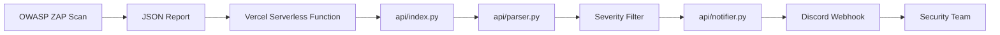

# 🚨 OWASP ZAP Alert Webhook

Serverless pipeline to receive **OWASP ZAP** JSON reports, filter **High** and **Critical** risk vulnerabilities, and automatically notify a team through a **Discord Webhook**.

This project was created to automate the prioritization of critical findings in **DevSecOps**, **automated penetration testing**, **CI/CD security scan**, and **continuous web application monitoring** workflows.

---

## 📌 Overview

The **OWASP ZAP Alert Webhook** works as an intermediary layer between OWASP ZAP and the team communication channel.

Instead of leaving JSON reports forgotten in pipeline artifacts, local folders, or rarely monitored dashboards, this project receives the report, extracts only the relevant alerts, and sends a summarized message to Discord.

### Main Flow

```text
OWASP ZAP
   ↓
JSON Report
   ↓
Serverless API on Vercel
   ↓
Alert Parser
   ↓
High/Critical Filter
   ↓
Discord Webhook
   ↓
Security Team
```

---

## 🎯 Problem Solved

Tools like OWASP ZAP generate complete reports, but those reports are not always reviewed quickly.

In real environments, this creates several problems:

* critical vulnerabilities may go unnoticed;
* reports may get lost in CI/CD artifacts;
* low-impact alerts create noise;
* the team takes longer to prioritize fixes;
* the security workflow does not integrate well with operational channels.

This project reduces that problem by automatically notifying only the most important findings.

---

## ✅ Proposed Solution

The application exposes an HTTP endpoint:

```http
POST /api
```

This endpoint receives an OWASP ZAP JSON report, processes the alerts, and sends to Discord only the findings classified as:

```text
High
Critical
```

The goal is not to replace a full vulnerability management platform, but to provide a lightweight, practical, and easy-to-integrate automation for DevSecOps pipelines.

---

## 🧱 Architecture



### Components

| Component                  | Function                                          |
| -------------------------- | ------------------------------------------------- |
| OWASP ZAP                  | Runs the security scan against the application    |
| JSON Report                | Report generated by ZAP                           |
| Vercel Serverless Function | Serverless environment that runs the API          |
| `api/index.py`             | Main endpoint that receives requests              |
| `api/parser.py`            | Normalizes and filters alerts                     |
| `api/notifier.py`          | Formats and sends the notification to Discord     |
| Discord Webhook            | Channel that receives the alerts                  |
| Security Team              | Responsible for analyzing and fixing the findings |

---

## 🗂️ Project Structure

```text
.
├── api/
│   ├── __init__.py
│   ├── index.py
│   ├── parser.py
│   └── notifier.py
│
├── docs/
│   └── images/
│       ├── criar-webhook.png
│       ├── request-funcional.png
│       └── canal-discord-resultado.png
│
├── vercel.json
├── README.md
├── README_EN.md
└── README_FR.md
```

---

## 📄 Core Files

| File              | Responsibility                                                   |
| ----------------- | ---------------------------------------------------------------- |
| `api/index.py`    | Serverless HTTP handler used by Vercel                           |
| `api/parser.py`   | Extraction, normalization, and filtering of OWASP ZAP alerts     |
| `api/notifier.py` | Builds the Discord-compatible payload and sends the notification |
| `api/__init__.py` | Enables proper Python module imports on Vercel                   |
| `vercel.json`     | Configures routing from `/api` and `/api/*` to `api/index.py`    |
| `README.md`       | Main documentation in Portuguese                                 |
| `README_EN.md`    | Documentation in English                                         |
| `README_FR.md`    | Documentation in French                                          |

---

## 🔁 Internal API Flow

When a `POST` request reaches `/api`, the application runs the following flow:

1. Receives the HTTP request.
2. Validates the `ZAP_API_KEY`, if configured.
3. Reads the JSON body from the request.
4. Sends the JSON to `parse_zap_report`.
5. Filters only relevant alerts.
6. Sends the alerts to `dispatch_alert`.
7. Builds a Discord-compatible message.
8. Sends the message to `TEAM_WEBHOOK_URL`.
9. Returns a JSON response with the processing status.

---

## 🔐 Environment Variables

Configure the following variables in Vercel.

| Variable           |    Required | Description                                      |
| ------------------ | ----------: | ------------------------------------------------ |
| `TEAM_WEBHOOK_URL` |         Yes | Discord webhook URL that will receive the alerts |
| `ZAP_API_KEY`      | Recommended | Key used to protect the `/api` endpoint          |

Example:

```env
TEAM_WEBHOOK_URL=https://discord.com/api/webhooks/SEU_WEBHOOK_ID/SEU_TOKEN
ZAP_API_KEY=sua-chave-secreta
```

> Do not wrap variables in quotes inside Vercel.

Correct:

```env
TEAM_WEBHOOK_URL=https://discord.com/api/webhooks/...
```

Incorrect:

```env
TEAM_WEBHOOK_URL="https://discord.com/api/webhooks/..."
```

---

## 🔑 How to Generate the `ZAP_API_KEY`

The `ZAP_API_KEY` is a key created by you. It does not come from OWASP ZAP.

It prevents anyone with the public API URL from sending fake alerts.

### Generate a key with Python

```bash
python -c "import secrets; print(secrets.token_urlsafe(32))"
```

Example output:

```text
gTOtvYq0z2PKixF4sQz4qP4O41PTu5yvdh3QKlF7gTQ
```

Use the generated value in Vercel:

```env
ZAP_API_KEY=gTOtvYq0z2PKixF4sQz4qP4O41PTu5yvdh3QKlF7gTQ
```

---

## 💬 How to Create the Discord Webhook

### 1. Create or choose a channel

Example:

```text
#zap-alerts
#security-alerts
#vulnerabilidades
```

### 2. Open the channel settings

Click the gear icon next to the channel.

### 3. Go to Integrations

Access:

```text
Integrações → Webhooks
```

### 4. Create a new webhook

Click:

```text
Novo webhook
```

Give it a name such as:

```text
OWASP ZAP Alerts
```

### 5. Copy the webhook URL

The URL will have a format similar to:

```text
https://discord.com/api/webhooks/WEBHOOK_ID/WEBHOOK_TOKEN
```

### Visual Example


---

## ⚠️ Webhook Security

The Discord webhook URL works like a password.

If it is exposed in:

* GitHub;
* public screenshots;
* videos;
* issues;
* documentation;
* old commits;

anyone will be able to send messages to your channel.

If this happens, immediately:

1. Delete the old webhook in Discord.
2. Create a new webhook.
3. Update `TEAM_WEBHOOK_URL` in Vercel.
4. Redeploy the project.
5. Test again.

Do not publish the real webhook in the README. Always use placeholders.

---

## 🚀 Deploying to Vercel

### 1. Log in to Vercel

```bash
vercel login
```

### 2. Deploy the project

From the project root:

```bash
vercel
```

Or, for production:

```bash
vercel --prod
```

### 3. Configure environment variables

In the Vercel dashboard:

```text
Project → Settings → Environment Variables
```

Add:

```env
TEAM_WEBHOOK_URL=https://discord.com/api/webhooks/...
ZAP_API_KEY=sua-chave-secreta
```

Select the environments:

```text
Production
Preview
Development
```

### 4. Redeploy

After changing environment variables, run a new deployment.

```bash
vercel --prod
```

Or push a new commit to the main branch if the project is connected to GitHub.

---

## 🧪 Testing the Webhook Directly

Before testing the API, validate that the Discord webhook is working.

### Using Git Bash

```bash
curl -X POST "https://discord.com/api/webhooks/SEU_WEBHOOK_ID/SEU_WEBHOOK_TOKEN" \
-H "Content-Type: application/json" \
-d '{"content":"Teste direto do webhook OWASP ZAP"}'
```

### Using PowerShell

```powershell
Invoke-RestMethod -Uri "https://discord.com/api/webhooks/SEU_WEBHOOK_ID/SEU_WEBHOOK_TOKEN" -Method Post -ContentType "application/json" -Body '{"content":"Teste direto do webhook OWASP ZAP"}'
```

### Expected result

The message should appear in the Discord channel:

```text
Teste direto do webhook OWASP ZAP
```

If the message appears, the webhook is working.

---

## 🧪 Testing the Serverless API

After deployment and environment variable configuration, send a test report to the API.

### Example with Git Bash

```bash
curl -X POST "https://SEU-PROJETO.vercel.app/api" \
-H "Content-Type: application/json" \
-H "X-ZAP-API-Key: SUA_CHAVE_SECRETA" \
-d '{"site":"https://example.com","alerts":[{"risk":"High","name":"SQL Injection","url":"https://example.com/login"}]}'
```

### One-line example

```bash
curl -X POST "https://SEU-PROJETO.vercel.app/api" -H "Content-Type: application/json" -H "X-ZAP-API-Key: SUA_CHAVE_SECRETA" -d '{"site":"https://example.com","alerts":[{"risk":"High","name":"SQL Injection","url":"https://example.com/login"}]}'
```

### Expected API response

```json
{
  "status": "processed",
  "alert_count": 1,
  "notifier": {
    "status": "sent",
    "code": 204,
    "alert_count": 1
  }
}
```

### Visual Example


---

## ✅ Result in Discord

When everything is working correctly, Discord will receive a message similar to:

```text
⚠️ OWASP ZAP Alert Summary

Total alerts: 1
Critical: 0
High: 1

Findings:

1. SQL Injection
   - Risk: High
   - URL: https://example.com/login
```

### Visual Example


---

## 📥 Expected Payload

The API expects to receive a JSON body containing a list of alerts.

Simplified example:

```json
{
  "site": "https://example.com",
  "alerts": [
    {
      "risk": "High",
      "name": "SQL Injection",
      "url": "https://example.com/login"
    },
    {
      "risk": "Critical",
      "name": "Remote Code Execution",
      "url": "https://example.com/upload"
    }
  ]
}
```

### Main Fields

| Field    | Description                        |
| -------- | ---------------------------------- |
| `site`   | Application analyzed by OWASP ZAP  |
| `alerts` | List of discovered vulnerabilities |
| `risk`   | Alert severity                     |
| `name`   | Vulnerability name                 |
| `url`    | Affected endpoint                  |

---

## 🔎 Processed Severities

The project focuses on prioritizing high-impact alerts.

| Severity      | Notify? |
| ------------- | ------: |
| Critical      |     Yes |
| High          |     Yes |
| Medium        |      No |
| Low           |      No |
| Informational |      No |

---

## 🔐 API Authentication

The API accepts authentication in two ways.

### Using `X-ZAP-API-Key`

```bash
-H "X-ZAP-API-Key: SUA_CHAVE_SECRETA"
```

### Using Bearer Token

```bash
-H "Authorization: Bearer SUA_CHAVE_SECRETA"
```

If the `ZAP_API_KEY` variable is not configured, the API will accept requests without authentication.

This may be useful for local testing, but it is not recommended in production.

---

## 🔁 OWASP ZAP Integration

A common workflow is to generate the JSON report with OWASP ZAP and send it to the API.

Conceptual example:

```bash
zap-baseline.py -t https://example.com -J zap-report.json
```

Then:

```bash
curl -X POST "https://SEU-PROJETO.vercel.app/api" \
-H "Content-Type: application/json" \
-H "X-ZAP-API-Key: SUA_CHAVE_SECRETA" \
-d @zap-report.json
```

---

## ⚙️ Example with GitHub Actions

This workflow runs a scan with OWASP ZAP and sends the report to the API.

```yaml
name: OWASP ZAP Security Scan

on:
  schedule:
    - cron: "0 2 * * *"
  workflow_dispatch:

jobs:
  zap_scan:
    runs-on: ubuntu-latest

    steps:
      - name: Checkout repository
        uses: actions/checkout@v4

      - name: Run OWASP ZAP Baseline Scan
        uses: zaproxy/action-baseline@v0.12.0
        with:
          target: "https://example.com"
          cmd_options: "-J zap-report.json"

      - name: Send ZAP report to webhook API
        run: |
          curl -X POST "${{ secrets.ZAP_WEBHOOK_API_URL }}" \
          -H "Content-Type: application/json" \
          -H "X-ZAP-API-Key: ${{ secrets.ZAP_API_KEY }}" \
          -d @zap-report.json
```

### Required GitHub Secrets

Configure them at:

```text
Repository → Settings → Secrets and variables → Actions
```

| Secret                | Value                                |
| --------------------- | ------------------------------------ |
| `ZAP_WEBHOOK_API_URL` | `https://SEU-PROJETO.vercel.app/api` |
| `ZAP_API_KEY`         | Same key configured in Vercel        |

---

## 🧯 Troubleshooting

### Error: `method_not_allowed`

Response:

```json
{
  "status": "method_not_allowed"
}
```

Cause:

You accessed `/api` through the browser.

The browser sends a `GET` request, but the API only accepts `POST`.

Solution:

Use `curl`, Postman, Insomnia, GitHub Actions, or another HTTP client to send a `POST`.

---

### Error: `invalid_json`

Response:

```json
{
  "status": "invalid_json"
}
```

Common cause:

Malformed JSON or quote escaping issues in the terminal.

Solution in Git Bash:

```bash
curl -X POST "https://SEU-PROJETO.vercel.app/api" \
-H "Content-Type: application/json" \
-H "X-ZAP-API-Key: SUA_CHAVE_SECRETA" \
-d '{"site":"https://example.com","alerts":[{"risk":"High","name":"SQL Injection","url":"https://example.com/login"}]}'
```

Solution in PowerShell:

```powershell
$body = @{
  site = "https://example.com"
  alerts = @(
    @{
      risk = "High"
      name = "SQL Injection"
      url = "https://example.com/login"
    }
  )
} | ConvertTo-Json -Depth 5

Invoke-RestMethod -Uri "https://SEU-PROJETO.vercel.app/api" -Method Post -ContentType "application/json" -Headers @{ "X-ZAP-API-Key" = "SUA_CHAVE_SECRETA" } -Body $body
```

---

### Error: `ModuleNotFoundError: No module named 'parser'`

Cause:

Vercel could not import the `parser.py` module.

Solution:

Use absolute imports:

```python
from api.parser import parse_zap_report
from api.notifier import dispatch_alert
```

And create the file:

```text
api/__init__.py
```

Correct structure:

```text
api/
├── __init__.py
├── index.py
├── parser.py
└── notifier.py
```

---

### Error: `notifier failed - code 403`

Example:

```json
{
  "status": "processed",
  "alert_count": 1,
  "notifier": {
    "status": "failed",
    "reason": "http_error",
    "code": 403,
    "alert_count": 1
  }
}
```

Possible causes:

1. Invalid `TEAM_WEBHOOK_URL`.
2. Old webhook deleted.
3. Webhook configured with quotes in Vercel.
4. Discord-incompatible payload.
5. Missing `User-Agent` in the HTTP request.
6. Old deployment still active.

Solutions:

* Create a new webhook in Discord.
* Update `TEAM_WEBHOOK_URL` in Vercel.
* Redeploy.
* Test the webhook directly.
* Ensure the payload sent to Discord uses `content` or `embeds`.
* Add `User-Agent` in `notifier.py`.

Example:

```python
request = urllib.request.Request(
    webhook_url,
    data=body,
    headers={
        "Content-Type": "application/json",
        "User-Agent": "OWASP-ZAP-Webhook/1.0",
    },
    method="POST",
)
```

---

### PowerShell Error with `curl`

In PowerShell, `curl` may be an alias for `Invoke-WebRequest`.

Prefer:

```powershell
curl.exe
```

or use directly:

```powershell
Invoke-RestMethod
```

Recommended example:

```powershell
Invoke-RestMethod -Uri "https://discord.com/api/webhooks/SEU_WEBHOOK_ID/SEU_WEBHOOK_TOKEN" -Method Post -ContentType "application/json" -Body '{"content":"Teste direto do webhook OWASP ZAP"}'
```

---

## 📊 Observability

Currently, debugging can be done through Vercel logs.

### View logs via CLI

```bash
vercel logs SEU-PROJETO.vercel.app
```

### View logs through the dashboard

```text
Vercel → Project → Deployments → Functions → Logs
```

The logs help identify errors such as:

* import failure;
* missing environment variable;
* invalid JSON;
* webhook failure;
* internal serverless function error.

---

## 🧪 Testing Best Practices

Before considering the project ready, validate:

* [ ] The direct Discord webhook receives a message.
* [ ] The API returns `method_not_allowed` on `GET`.
* [ ] The API accepts `POST` with valid JSON.
* [ ] The API rejects requests without a key when `ZAP_API_KEY` is configured.
* [ ] The API returns `invalid_json` for invalid bodies.
* [ ] The API sends alerts to Discord.
* [ ] Discord receives the formatted alert.
* [ ] Vercel is using the updated environment variables.
* [ ] A new deployment was performed after changing environment variables.

---

## 🛡️ Security

### What this project already does

* Allows key-based authentication through `ZAP_API_KEY`.
* Accepts authentication through a custom header.
* Accepts authentication through Bearer Token.
* Prevents direct exposure of the webhook in the code.
* Uses environment variables for secrets.

### What can still be improved

* Rate limiting.
* Stricter schema validation.
* Structured logs.
* HMAC signature.
* IP allowlist.
* Replay protection.
* Stricter payload sanitization.
* Automated security tests.

---

## 🧠 Real-World Use Cases

### 1. Automated nightly penetration test

```text
Cron Job
↓
OWASP ZAP
↓
JSON Report
↓
Webhook API
↓
Discord
↓
Team reviews it in the morning
```

### 2. DevSecOps Pipeline

```text
Pull Request
↓
Deploy Preview
↓
OWASP ZAP Scan
↓
Serverless API
↓
Critical vulnerability alert
```

### 3. API Security

The project can be used to monitor critical endpoints and alert the team when severe issues are found.

### 4. Internal Bug Bounty

It can support internal vulnerability hunting programs by automating communication for the highest-severity findings.

---

## 🧭 Roadmap

### Short Term

* [ ] Improve Discord messages using `embeds`.
* [ ] Add unit tests for `parser.py`.
* [ ] Add unit tests for `notifier.py`.
* [ ] Add JSON schema validation.
* [ ] Improve Discord error logs.

### Medium Term

* [ ] Slack support.
* [ ] Microsoft Teams support.
* [ ] Multiple webhook support.
* [ ] Add automatic retry.
* [ ] Add rate limiting.

### Long Term

* [ ] Vulnerability dashboard.
* [ ] Scan history.
* [ ] PostgreSQL database.
* [ ] Trend metrics.
* [ ] Scan comparison.
* [ ] Jira integration.
* [ ] GitHub Issues integration.
* [ ] Automatic classification by criticality and affected asset.

---

## 💼 Skills I Aimed to Demonstrate in This Project

This project was created with skills relevant to the following areas:

* Information Security;
* DevSecOps;
* Automation;
* Backend;
* Cloud;
* Tool integration;
* Automated penetration testing.

### Technical Skills

* Python
* Serverless Functions
* Vercel
* OWASP ZAP
* Webhooks
* Discord API
* HTTP APIs
* JSON parsing
* CI/CD
* GitHub Actions
* Environment Variables
* Secure API Design

### Security Skills

* Vulnerability prioritization
* Alert automation
* Operational noise reduction
* Endpoint protection with API Key
* Secret management best practices
* Security tool integration into pipelines

---

## 🧪 Example of a Final Functional Response

After fixing the Discord payload and correctly configuring the webhook, the API should return:

```json
{
  "status": "processed",
  "alert_count": 1,
  "notifier": {
    "status": "sent",
    "code": 204,
    "alert_count": 1
  }
}
```

And Discord should receive:

```text
⚠️ OWASP ZAP Alert Summary

Total alerts: 1
Critical: 0
High: 1

Findings:

1. SQL Injection
   - Risk: High
   - URL: https://example.com/login
```

---

## 📌 Project Status

```text
Status: Functional
Deploy: Vercel
Notification: Discord Webhook
Main endpoint: POST /api
Authentication: ZAP_API_KEY
```

---

## 📄 License

This project can be used as a foundation for studies, portfolio work, and internal security automations.

Before using it in production, review:

* access control;
* logs;
* rate limiting;
* payload validation;
* secret protection;
* data retention policy.

---

## ⚗️ Test Lab

The deployment of this project was created by me for testing at the following link: https://security-automation-zap-alert-webho.vercel.app/api

---

## 👨‍💻 Author: João Victor S.S.

Developed as a practical DevSecOps automation project focused on offensive security, defensive security, and integration of vulnerability analysis tools.
