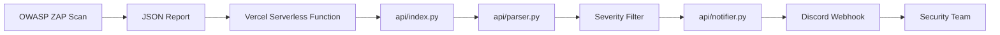
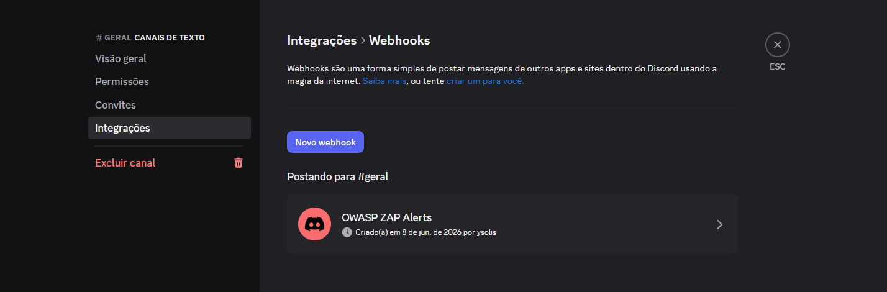
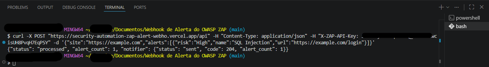
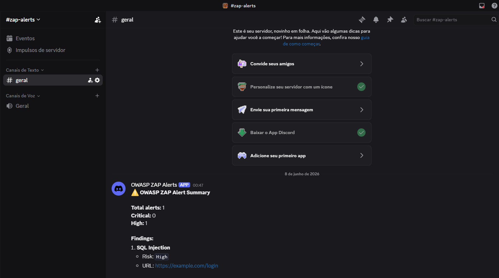

# 🚨 OWASP ZAP Alert Webhook

Pipeline serverless permettant de recevoir des rapports JSON de **OWASP ZAP**, de filtrer les vulnérabilités de risque **High** et **Critical**, puis de notifier automatiquement une équipe via un **Discord Webhook**.

Ce projet a été créé pour automatiser la priorisation des constats critiques dans des flux de **DevSecOps**, de **test d’intrusion automatisé**, de **scan de sécurité CI/CD** et de **surveillance continue d’applications web**.

---

## 📌 Vue d’ensemble

Le **OWASP ZAP Alert Webhook** fonctionne comme une couche intermédiaire entre OWASP ZAP et le canal de communication de l’équipe.

Au lieu de laisser les rapports JSON oubliés dans des artefacts de pipeline, des dossiers locaux ou des tableaux de bord peu consultés, ce projet reçoit le rapport, extrait uniquement les alertes pertinentes et envoie un résumé vers Discord.

### Flux principal

```text
OWASP ZAP
   ↓
Relatório JSON
   ↓
API Serverless na Vercel
   ↓
Parser de alertas
   ↓
Filtro High/Critical
   ↓
Discord Webhook
   ↓
Equipe de Segurança
```

---

## 🎯 Problème Résolu

Des outils comme OWASP ZAP génèrent des rapports complets, mais ces rapports ne sont pas toujours analysés rapidement.

Dans des environnements réels, cela crée plusieurs problèmes :

* des vulnérabilités critiques peuvent passer inaperçues ;
* les rapports peuvent rester perdus dans les artefacts CI/CD ;
* les alertes à faible impact créent du bruit opérationnel ;
* l’équipe prend plus de temps pour prioriser les corrections ;
* le flux de sécurité s’intègre mal aux canaux opérationnels.

Ce projet réduit ce problème en notifiant automatiquement uniquement les constats les plus importants.

---

## ✅ Solution Proposée

L’application expose un endpoint HTTP :

```http
POST /api
```

Cet endpoint reçoit un rapport JSON d’OWASP ZAP, traite les alertes et envoie vers Discord uniquement les constats classés comme :

```text
High
Critical
```

L’objectif n’est pas de remplacer une plateforme complète de gestion des vulnérabilités, mais de créer une automatisation légère, pratique et facile à intégrer dans des pipelines DevSecOps.

---

## 🧱 Architecture



### Composants

| Composant                  | Fonction                                                  |
| -------------------------- | --------------------------------------------------------- |
| OWASP ZAP                  | Exécute le scan de sécurité sur l’application             |
| JSON Report                | Rapport généré par ZAP                                    |
| Vercel Serverless Function | Environnement serverless qui exécute l’API                |
| `api/index.py`             | Endpoint principal qui reçoit les requêtes                |
| `api/parser.py`            | Normalise et filtre les alertes                           |
| `api/notifier.py`          | Formate et envoie la notification vers Discord            |
| Discord Webhook            | Canal de réception des alertes                            |
| Équipe de Sécurité         | Responsable de l’analyse et de la correction des constats |

---

## 🗂️ Structure du Projet

```text
.
├── api/
│   ├── __init__.py
│   ├── index.py
│   ├── parser.py
│   └── notifier.py
│
├── docs/
│   └── images/
│       ├── criar-webhook.png
│       ├── request-funcional.png
│       └── canal-discord-resultado.png
│
├── vercel.json
├── README.md
├── README_EN.md
└── README_FR.md
```

---

## 📄 Fichiers Principaux

| Fichier           | Responsabilité                                                              |
| ----------------- | --------------------------------------------------------------------------- |
| `api/index.py`    | Handler HTTP serverless utilisé par Vercel                                  |
| `api/parser.py`   | Extraction, normalisation et filtrage des alertes OWASP ZAP                 |
| `api/notifier.py` | Construction du payload compatible avec Discord et envoi de la notification |
| `api/__init__.py` | Permet l’importation correcte des modules Python sur Vercel                 |
| `vercel.json`     | Configure le routage de `/api` et `/api/*` vers `api/index.py`              |
| `README.md`       | Documentation principale en portugais                                       |
| `README_EN.md`    | Documentation en anglais                                                    |
| `README_FR.md`    | Documentation en français                                                   |

---

## 🔁 Flux Interne de l’API

Lorsqu’une requête `POST` arrive sur `/api`, l’application exécute le flux suivant :

1. Reçoit la requête HTTP.
2. Valide la clé `ZAP_API_KEY`, si elle est configurée.
3. Lit le corps JSON de la requête.
4. Envoie le JSON vers `parse_zap_report`.
5. Filtre uniquement les alertes pertinentes.
6. Envoie les alertes vers `dispatch_alert`.
7. Construit un message compatible avec Discord.
8. Envoie le message vers `TEAM_WEBHOOK_URL`.
9. Retourne une réponse JSON avec le statut du traitement.

---

## 🔐 Variables d’Environnement

Configurez les variables ci-dessous dans Vercel.

| Variable           | Obligatoire | Description                                    |
| ------------------ | ----------: | ---------------------------------------------- |
| `TEAM_WEBHOOK_URL` |         Oui | URL du webhook Discord qui recevra les alertes |
| `ZAP_API_KEY`      | Recommandée | Clé utilisée pour protéger l’endpoint `/api`   |

Exemple :

```env
TEAM_WEBHOOK_URL=https://discord.com/api/webhooks/SEU_WEBHOOK_ID/SEU_TOKEN
ZAP_API_KEY=sua-chave-secreta
```

> Ne mettez pas de guillemets autour des variables dans Vercel.

Correct :

```env
TEAM_WEBHOOK_URL=https://discord.com/api/webhooks/...
```

Incorrect :

```env
TEAM_WEBHOOK_URL="https://discord.com/api/webhooks/..."
```

---

## 🔑 Comment Générer la `ZAP_API_KEY`

La `ZAP_API_KEY` est une clé que vous créez vous-même. Elle ne vient pas d’OWASP ZAP.

Elle sert à empêcher toute personne possédant l’URL publique de l’API d’envoyer de fausses alertes.

### Générer une clé avec Python

```bash
python -c "import secrets; print(secrets.token_urlsafe(32))"
```

Exemple de sortie :

```text
gTOtvYq0z2PKixF4sQz4qP4O41PTu5yvdh3QKlF7gTQ
```

Utilisez la valeur générée dans Vercel :

```env
ZAP_API_KEY=gTOtvYq0z2PKixF4sQz4qP4O41PTu5yvdh3QKlF7gTQ
```

---

## 💬 Comment Créer le Webhook Discord

### 1. Créez ou choisissez un canal

Exemple :

```text
#zap-alerts
#security-alerts
#vulnerabilidades
```

### 2. Ouvrez les paramètres du canal

Cliquez sur l’icône d’engrenage à côté du canal.

### 3. Allez dans les intégrations

Accédez à :

```text
Integrações → Webhooks
```

### 4. Créez un nouveau webhook

Cliquez sur :

```text
Novo webhook
```

Donnez-lui un nom comme :

```text
OWASP ZAP Alerts
```

### 5. Copiez l’URL du webhook

L’URL aura un format similaire à :

```text
https://discord.com/api/webhooks/WEBHOOK_ID/WEBHOOK_TOKEN
```

### Exemple visuel



---

## ⚠️ Sécurité du Webhook

L’URL du webhook Discord fonctionne comme un mot de passe.

Si elle est exposée dans :

* GitHub ;
* des captures d’écran publiques ;
* des vidéos ;
* des issues ;
* de la documentation ;
* d’anciens commits ;

n’importe qui pourra envoyer des messages dans votre canal.

Si cela arrive, faites immédiatement :

1. Supprimez l’ancien webhook dans Discord.
2. Créez un nouveau webhook.
3. Mettez à jour `TEAM_WEBHOOK_URL` dans Vercel.
4. Effectuez un nouveau déploiement.
5. Testez à nouveau.

Ne publiez jamais le webhook réel dans le README. Utilisez toujours des placeholders.

---

## 🚀 Déploiement sur Vercel

### 1. Connectez-vous à Vercel

```bash
vercel login
```

### 2. Faites le déploiement

À la racine du projet :

```bash
vercel
```

Ou, pour la production :

```bash
vercel --prod
```

### 3. Configurez les variables d’environnement

Dans le tableau de bord Vercel :

```text
Project → Settings → Environment Variables
```

Ajoutez :

```env
TEAM_WEBHOOK_URL=https://discord.com/api/webhooks/...
ZAP_API_KEY=sua-chave-secreta
```

Sélectionnez les environnements :

```text
Production
Preview
Development
```

### 4. Faites un nouveau déploiement

Après avoir modifié les variables d’environnement, effectuez un nouveau déploiement.

```bash
vercel --prod
```

Ou envoyez un nouveau commit vers la branche principale si le projet est connecté à GitHub.

---

## 🧪 Tester Directement le Webhook

Avant de tester l’API, validez que le webhook Discord fonctionne.

### Avec Git Bash

```bash
curl -X POST "https://discord.com/api/webhooks/SEU_WEBHOOK_ID/SEU_WEBHOOK_TOKEN" \
-H "Content-Type: application/json" \
-d '{"content":"Teste direto do webhook OWASP ZAP"}'
```

### Avec PowerShell

```powershell
Invoke-RestMethod -Uri "https://discord.com/api/webhooks/SEU_WEBHOOK_ID/SEU_WEBHOOK_TOKEN" -Method Post -ContentType "application/json" -Body '{"content":"Teste direto do webhook OWASP ZAP"}'
```

### Résultat attendu

Le message doit apparaître dans le canal Discord :

```text
Teste direto do webhook OWASP ZAP
```

Si le message apparaît, le webhook fonctionne.

---

## 🧪 Tester l’API Serverless

Après le déploiement et la configuration des variables, envoyez un rapport de test à l’API.

### Exemple avec Git Bash

```bash
curl -X POST "https://SEU-PROJETO.vercel.app/api" \
-H "Content-Type: application/json" \
-H "X-ZAP-API-Key: SUA_CHAVE_SECRETA" \
-d '{"site":"https://example.com","alerts":[{"risk":"High","name":"SQL Injection","url":"https://example.com/login"}]}'
```

### Exemple en une seule ligne

```bash
curl -X POST "https://SEU-PROJETO.vercel.app/api" -H "Content-Type: application/json" -H "X-ZAP-API-Key: SUA_CHAVE_SECRETA" -d '{"site":"https://example.com","alerts":[{"risk":"High","name":"SQL Injection","url":"https://example.com/login"}]}'
```

### Réponse attendue de l’API

```json
{
  "status": "processed",
  "alert_count": 1,
  "notifier": {
    "status": "sent",
    "code": 204,
    "alert_count": 1
  }
}
```

### Exemple visuel



---

## ✅ Résultat dans Discord

Lorsque tout fonctionne correctement, Discord reçoit un message similaire à :

```text
⚠️ OWASP ZAP Alert Summary

Total alerts: 1
Critical: 0
High: 1

Findings:

1. SQL Injection
   - Risk: High
   - URL: https://example.com/login
```

### Exemple visuel



---

## 📥 Payload Attendu

L’API s’attend à recevoir un JSON contenant une liste d’alertes.

Exemple simplifié :

```json
{
  "site": "https://example.com",
  "alerts": [
    {
      "risk": "High",
      "name": "SQL Injection",
      "url": "https://example.com/login"
    },
    {
      "risk": "Critical",
      "name": "Remote Code Execution",
      "url": "https://example.com/upload"
    }
  ]
}
```

### Champs principaux

| Champ    | Description                        |
| -------- | ---------------------------------- |
| `site`   | Application analysée par OWASP ZAP |
| `alerts` | Liste des vulnérabilités détectées |
| `risk`   | Sévérité de l’alerte               |
| `name`   | Nom de la vulnérabilité            |
| `url`    | Endpoint affecté                   |

---

## 🔎 Sévérités Traitées

Le projet vise à prioriser les alertes à fort impact.

| Sévérité      | Notification ? |
| ------------- | -------------: |
| Critical      |            Oui |
| High          |            Oui |
| Medium        |            Non |
| Low           |            Non |
| Informational |            Non |

---

## 🔐 Authentification de l’API

L’API accepte l’authentification de deux manières.

### Avec `X-ZAP-API-Key`

```bash
-H "X-ZAP-API-Key: SUA_CHAVE_SECRETA"
```

### Avec Bearer Token

```bash
-H "Authorization: Bearer SUA_CHAVE_SECRETA"
```

Si la variable `ZAP_API_KEY` n’est pas configurée, l’API acceptera les requêtes sans authentification.

Cela peut être utile pour des tests locaux, mais ce n’est pas recommandé en production.

---

## 🔁 Intégration avec OWASP ZAP

Un flux courant consiste à générer le rapport JSON avec OWASP ZAP puis à l’envoyer à l’API.

Exemple conceptuel :

```bash
zap-baseline.py -t https://example.com -J zap-report.json
```

Puis :

```bash
curl -X POST "https://SEU-PROJETO.vercel.app/api" \
-H "Content-Type: application/json" \
-H "X-ZAP-API-Key: SUA_CHAVE_SECRETA" \
-d @zap-report.json
```

---

## ⚙️ Exemple avec GitHub Actions

Ce workflow exécute un scan avec OWASP ZAP et envoie le rapport à l’API.

```yaml
name: OWASP ZAP Security Scan

on:
  schedule:
    - cron: "0 2 * * *"
  workflow_dispatch:

jobs:
  zap_scan:
    runs-on: ubuntu-latest

    steps:
      - name: Checkout repository
        uses: actions/checkout@v4

      - name: Run OWASP ZAP Baseline Scan
        uses: zaproxy/action-baseline@v0.12.0
        with:
          target: "https://example.com"
          cmd_options: "-J zap-report.json"

      - name: Send ZAP report to webhook API
        run: |
          curl -X POST "${{ secrets.ZAP_WEBHOOK_API_URL }}" \
          -H "Content-Type: application/json" \
          -H "X-ZAP-API-Key: ${{ secrets.ZAP_API_KEY }}" \
          -d @zap-report.json
```

### Secrets nécessaires dans GitHub

Configurez-les dans :

```text
Repository → Settings → Secrets and variables → Actions
```

| Secret                | Valeur                               |
| --------------------- | ------------------------------------ |
| `ZAP_WEBHOOK_API_URL` | `https://SEU-PROJETO.vercel.app/api` |
| `ZAP_API_KEY`         | Même clé configurée dans Vercel      |

---

## 🧯 Dépannage

### Erreur : `method_not_allowed`

Réponse :

```json
{
  "status": "method_not_allowed"
}
```

Cause :

Vous avez accédé à `/api` depuis le navigateur.

Le navigateur envoie une requête `GET`, mais l’API accepte uniquement `POST`.

Solution :

Utilisez `curl`, Postman, Insomnia, GitHub Actions ou un autre client HTTP pour envoyer une requête `POST`.

---

### Erreur : `invalid_json`

Réponse :

```json
{
  "status": "invalid_json"
}
```

Cause courante :

JSON mal formaté ou problème d’échappement des guillemets dans le terminal.

Solution avec Git Bash :

```bash
curl -X POST "https://SEU-PROJETO.vercel.app/api" \
-H "Content-Type: application/json" \
-H "X-ZAP-API-Key: SUA_CHAVE_SECRETA" \
-d '{"site":"https://example.com","alerts":[{"risk":"High","name":"SQL Injection","url":"https://example.com/login"}]}'
```

Solution avec PowerShell :

```powershell
$body = @{
  site = "https://example.com"
  alerts = @(
    @{
      risk = "High"
      name = "SQL Injection"
      url = "https://example.com/login"
    }
  )
} | ConvertTo-Json -Depth 5

Invoke-RestMethod -Uri "https://SEU-PROJETO.vercel.app/api" -Method Post -ContentType "application/json" -Headers @{ "X-ZAP-API-Key" = "SUA_CHAVE_SECRETA" } -Body $body
```

---

### Erreur : `ModuleNotFoundError: No module named 'parser'`

Cause :

Vercel n’a pas réussi à importer le module `parser.py`.

Solution :

Utilisez des imports absolus :

```python
from api.parser import parse_zap_report
from api.notifier import dispatch_alert
```

Et créez le fichier :

```text
api/__init__.py
```

Structure correcte :

```text
api/
├── __init__.py
├── index.py
├── parser.py
└── notifier.py
```

---

### Erreur : `notifier failed - code 403`

Exemple :

```json
{
  "status": "processed",
  "alert_count": 1,
  "notifier": {
    "status": "failed",
    "reason": "http_error",
    "code": 403,
    "alert_count": 1
  }
}
```

Causes possibles :

1. `TEAM_WEBHOOK_URL` invalide.
2. Ancien webhook supprimé.
3. Webhook configuré avec des guillemets dans Vercel.
4. Payload incompatible avec Discord.
5. Absence de `User-Agent` dans la requête HTTP.
6. Ancien déploiement encore actif.

Solutions :

* Créez un nouveau webhook dans Discord.
* Mettez à jour `TEAM_WEBHOOK_URL` dans Vercel.
* Redéployez.
* Testez directement le webhook.
* Assurez-vous que le payload envoyé à Discord utilise `content` ou `embeds`.
* Ajoutez `User-Agent` dans `notifier.py`.

Exemple :

```python
request = urllib.request.Request(
    webhook_url,
    data=body,
    headers={
        "Content-Type": "application/json",
        "User-Agent": "OWASP-ZAP-Webhook/1.0",
    },
    method="POST",
)
```

---

### Erreur PowerShell avec `curl`

Dans PowerShell, `curl` peut être un alias de `Invoke-WebRequest`.

Préférez :

```powershell
curl.exe
```

ou utilisez directement :

```powershell
Invoke-RestMethod
```

Exemple recommandé :

```powershell
Invoke-RestMethod -Uri "https://discord.com/api/webhooks/SEU_WEBHOOK_ID/SEU_WEBHOOK_TOKEN" -Method Post -ContentType "application/json" -Body '{"content":"Teste direto do webhook OWASP ZAP"}'
```

---

## 📊 Observabilité

Actuellement, le débogage peut être fait à partir des logs de Vercel.

### Voir les logs via CLI

```bash
vercel logs SEU-PROJETO.vercel.app
```

### Voir les logs depuis le tableau de bord

```text
Vercel → Project → Deployments → Functions → Logs
```

Les logs aident à identifier des erreurs comme :

* échec d’importation ;
* variable d’environnement absente ;
* JSON invalide ;
* échec du webhook ;
* erreur interne de la fonction serverless.

---

## 🧪 Bonnes Pratiques de Test

Avant de considérer le projet comme prêt, validez :

* [ ] Le webhook direct de Discord reçoit un message.
* [ ] L’API retourne `method_not_allowed` en `GET`.
* [ ] L’API accepte un `POST` avec un JSON valide.
* [ ] L’API rejette les requêtes sans clé lorsque `ZAP_API_KEY` est configurée.
* [ ] L’API retourne `invalid_json` pour un corps invalide.
* [ ] L’API envoie l’alerte vers Discord.
* [ ] Discord reçoit l’alerte formatée.
* [ ] Vercel utilise les variables mises à jour.
* [ ] Un nouveau déploiement a été effectué après la modification des variables d’environnement.

---

## 🛡️ Sécurité

### Ce que ce projet fait déjà

* Permet l’authentification par clé via `ZAP_API_KEY`.
* Accepte l’authentification via un header personnalisé.
* Accepte l’authentification via Bearer Token.
* Évite l’exposition directe du webhook dans le code.
* Utilise des variables d’environnement pour les secrets.

### Ce qui peut encore être amélioré

* Rate limiting.
* Validation de schéma plus stricte.
* Logs structurés.
* Signature HMAC.
* Allowlist d’IP.
* Protection contre le rejeu.
* Sanitisation plus stricte du payload.
* Tests de sécurité automatisés.

---

## 🧠 Cas d’Utilisation Réels

### 1. Test d’intrusion nocturne automatisé

```text
Cron Job
↓
OWASP ZAP
↓
Relatório JSON
↓
Webhook API
↓
Discord
↓
Equipe analisa pela manhã
```

### 2. Pipeline DevSecOps

```text
Pull Request
↓
Deploy Preview
↓
OWASP ZAP Scan
↓
API Serverless
↓
Alerta de vulnerabilidades críticas
```

### 3. Sécurité des APIs

Le projet peut être utilisé pour surveiller des endpoints critiques et alerter l’équipe lorsque des problèmes graves sont détectés.

### 4. Bug Bounty interne

Il peut soutenir des programmes internes de recherche de vulnérabilités en automatisant la communication des constats de plus haute sévérité.

---

## 🧭 Roadmap

### Court Terme

* [ ] Améliorer les messages Discord avec `embeds`.
* [ ] Ajouter des tests unitaires pour `parser.py`.
* [ ] Ajouter des tests unitaires pour `notifier.py`.
* [ ] Ajouter une validation de schéma JSON.
* [ ] Améliorer les logs d’erreur Discord.

### Moyen Terme

* [ ] Support de Slack.
* [ ] Support de Microsoft Teams.
* [ ] Support de plusieurs webhooks.
* [ ] Ajouter un retry automatique.
* [ ] Ajouter du rate limiting.

### Long Terme

* [ ] Tableau de bord des vulnérabilités.
* [ ] Historique des scans.
* [ ] Base de données PostgreSQL.
* [ ] Métriques de tendance.
* [ ] Comparaison entre scans.
* [ ] Intégration avec Jira.
* [ ] Intégration avec GitHub Issues.
* [ ] Classification automatique par criticité et actif affecté.

---

## 💼 Compétences Démontrées

Ce projet démontre des compétences pertinentes pour les domaines suivants :

* Sécurité de l’Information ;
* DevSecOps ;
* Automatisation ;
* Backend ;
* Cloud ;
* Intégration d’outils ;
* Test d’intrusion automatisé.

### Compétences techniques

* Python
* Serverless Functions
* Vercel
* OWASP ZAP
* Webhooks
* Discord API
* HTTP APIs
* JSON parsing
* CI/CD
* GitHub Actions
* Environment Variables
* Secure API Design

### Compétences en sécurité

* Priorisation des vulnérabilités
* Automatisation des alertes
* Réduction du bruit opérationnel
* Protection d’endpoints avec API Key
* Bonnes pratiques de gestion des secrets
* Intégration d’outils de sécurité dans un pipeline

---

## 🧪 Exemple de Réponse Finale Fonctionnelle

Après la correction du payload Discord et la configuration correcte du webhook, l’API doit retourner :

```json
{
  "status": "processed",
  "alert_count": 1,
  "notifier": {
    "status": "sent",
    "code": 204,
    "alert_count": 1
  }
}
```

Et Discord doit recevoir :

```text
⚠️ OWASP ZAP Alert Summary

Total alerts: 1
Critical: 0
High: 1

Findings:

1. SQL Injection
   - Risk: High
   - URL: https://example.com/login
```

---

## 📌 Statut du Projet

```text
Status: Funcional
Deploy: Vercel
Notificação: Discord Webhook
Endpoint principal: POST /api
Autenticação: ZAP_API_KEY
```

---

## 📄 Licence

Ce projet peut être utilisé comme base pour des études, un portfolio et des automatisations internes de sécurité.

Avant de l’utiliser en production, révisez :

* le contrôle d’accès ;
* les logs ;
* le rate limiting ;
* la validation du payload ;
* la protection des secrets ;
* la politique de rétention des données.

---

## 👨‍💻 Auteur

Développé comme projet pratique d’automatisation DevSecOps, avec un accent sur la sécurité offensive, la sécurité défensive et l’intégration d’outils d’analyse de vulnérabilités.
